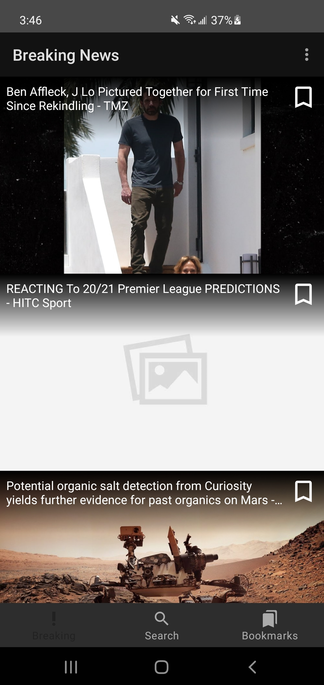
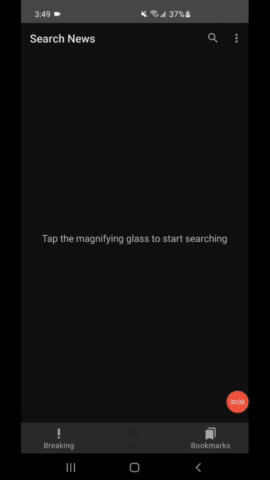
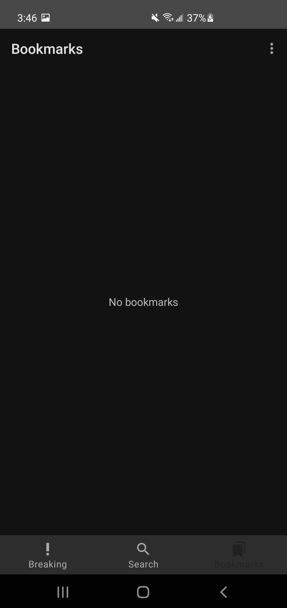
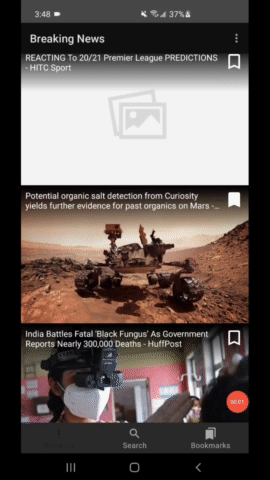
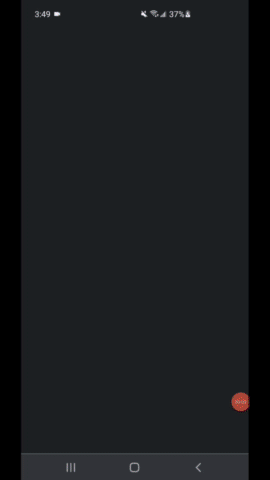

# :newspaper:MVVM News:newspaper:
MVVM News is an android application that will allow users to browse a a variety of news article.

This application includes:
- Option to browse a list of recent news:heavy_check_mark:
- Option to bookmark a news article to view whenever you would like:heavy_check_mark:
- Option to navigate to a news artcile webiste:heavy_check_mark:
- Option to search for a news article:heavy_check_mark:
- Option to manually refresh the news article list while browsing:heavy_check_mark:
## Motivation
The purpose of this application is to demonstrate my android development skills.
This application consists of libraries and best practices such as:
  1. MVVM/MVI architecture (clean architecture):heavy_check_mark:
  2. Retrofit(+ GSON):heavy_check_mark:
  3. Dagger Hilt:heavy_check_mark:
  4. Room (local database):heavy_check_mark:
  5. Android Jetpack:heavy_check_mark:
## :camera:Screenshots:camera:

User will have the option to browse a list of recent news article

  

User will have the option to search for articles

  
  

User will have the option to bookmark an article

  
  

Users will have the option to navigate to an article to read about

  

## Framework
**Built with**
- [Retrofit](https://square.github.io/retrofit/)
- [Dagger-Hilt](https://developer.android.com/training/dependency-injection/hilt-android)
- [Room](https://developer.android.com/training/data-storage/room)
- [Android Jetpack](https://developer.android.com/jetpack)
- [Gson](https://github.com/square/retrofit/tree/master/retrofit-converters/gson)

## API Reference
- [News API](https://newsapi.org/):computer:

## License
    Copyright 2021 Daniel Toriz Valdovinos
